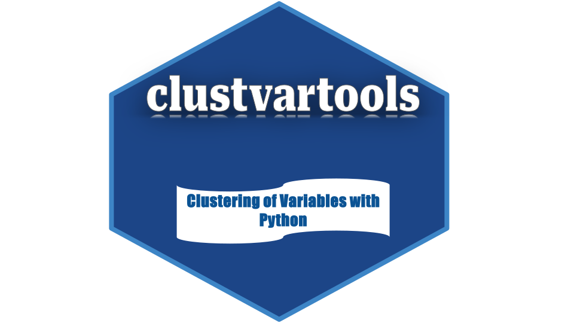
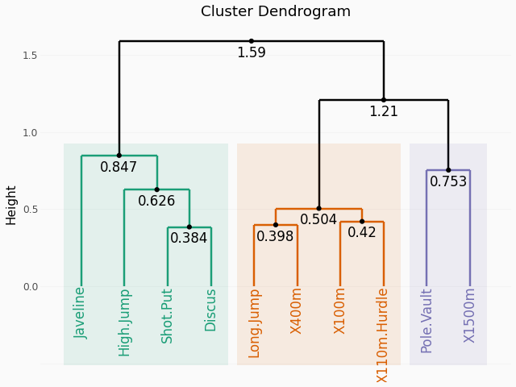

<p align="center">
    </img>
</p>

<div align="center">

[](https://github.com/enfantbenidedieu/clustvartools/blob/master/LICENSE)
[](https://pypi.org/project/clustvartools/)
[](https://pepy.tech/project/clustvartools)
[](https://pepy.tech/project/clustvartools)
[](https://pepy.tech/project/clustvartools)

</div>

# clustvartools : Clustering of Variables with Python

# Contents

**1. [Overview](#overview)**

**2. [Installation](#installation)**

* [2.1 Global environmen](#genv)
* [2.2 Virtual environment](#venv)
* [2.3 Version](#version)
* [2.4 Dependencies](#dependencies)

**3. [Example](#example)**

**4. [Documentation](#doc)**

**5. [About us](#about_us)**

* [5.1 Authors](#authors)
* [5.2 Feedbacks](#authors)
* [5.3 Citing clustvartools](#citing)

## Overview <a name="overview"></a>

clustvartools is a python library for clustering of variables. It provides functions for :

1. **Cluster Analysis**

    1. *CatCLV* - Hierarchical Clustering of Categorical Variables around Latent Variables
    2. *CatHCAV* - Hierarchical Clustering Analysis of Categorical Variables
    3. *CatVARHCA* - Categorical Variables Hierarchical Clustering Analysis
    4. *CLV* - Hierarchical Clustering of Variables around Latent Variables
    5. *CLVmix* - Hierarchical Clustering of Mixed Variables around Latent Variables
    6. *CorCLV* - Hierarchical Clustering of Variables from a covariance/correlation matrix
    7. *DCLV* - Divisive Clustering of Variables around Latent Variables
    8. *HCAV* - Hierarchical Clustering Analysis for Variables
    9. *HCAVmix* - Hierarchical Clustering Analysis of Variables for Mixed Data

4. In some methods, it allowed to add supplementary variables.
5. It provides a geometrical point of view.
6. It provides efficient implementations, using a scikit-learn API.

## Installation <a name="installation"></a>

### Global environment <a name="genv"></a>

You can directly install clustvartools using pip :

```bash
pip install clustvartools
```

or set a virtual environment.

### Virtual environment <a name="venv"></a>

Install the 64-bit version of Python 3, for instance from the [official website](https://www.python.org/). Now create a [virtual environment (venv)](https://docs.python.org/3/tutorial/venv.html) and install clustvartools.

The virtual environment is optional but strongly recommended, in order to avoid potential conflicts with other packages.

```bash
PS C:\> python -m venv clustvartools-env # create virtual env
PS C:\> clustvartools-env\Scripts\activate  # activate
PS C:\> pip install -U clustvartools  # install clustvartools
```

### Version <a name="version"></a>

In order to check your installation, you can use.

```python
>>> import clustvartools
>>> print(clustvartools.__version__)
0.0.1.post1
```

Using an isolated environment such as *pip venv* or *conda* makes it possible to install a specific version of clustvartools with pip and conda and its dependencies independently of any previously installed Python packages.

You should always remember to activate the environment of your choice prior to running any Python command whenever you start a new terminal session.

### Dependencies <a name="dependencies"></a>

clustvartools is compatible with python version which supports both dependencies :

| Packages          |  Version |
| :---------------- | :------: |
| numpy             | 1.21     |
| pandas            | 1.4      |
| scikit-learn      | 1.2      |
| statsmodels       | 0.14.6   |
| plotnine          | 0.10.1   |
| openpyxl          | 3.1.5    |
| adjustText        | 0.8.2    |
| pyreadr           | 0.5.4    |
| mizani            | 0.14.4   |
| tabulate          | 0.9.0    |

## Example <a name="example"></a>

1. **Loading data**

```python
>>> from clustvartools.datasets import decathlon
>>> data = decathlon.data
```

2. **Clustering of variables around Latent Variables (CLV)**

```python
>>> from clustvartools import CLV
>>> clf = CLV(ncl=3,sup_var=(10,11,12))
>>> clf.fit(data)
CLV(ncl=3,sup_var=(10,11,12))
```

3. **Visualize dendrogram**

```python
>>> from clustvartools import fviz_dend
>>> p = fviz_dend(obj=clf,color_labels_by_cluster=True,rect = True,rect_fill = True,color_labels_by_cluster=True,text_size=12,text_height=True,nudge_y=-0.03)
>>> print(p.show())
```
<center>
    
</center>

4. **Extract results**

```python
>>> # extract the results for variables
>>> quanti_var = clf.quanti_var_
>>> quanti_var._fields
... ('cluster','cor','cortest','sqload','member','sim','loadings')
```

## Documentation <a name="doc"></a>

The official documentation is hosted on [https://clustvartools.readthedocs.io](https://clustvartools.readthedocs.io).

## About Us <a name="about_us"></a>

### Authors <a name="authors"></a>

clustvartools is developed and maintained by [Duvérier DJIFACK ZEBAZE](https://www.linkedin.com/in/duv%C3%A9rier-djifack-z-030097118/), the founder of djifacklab (*Djifack Laboratory of Mathematics, Statistics and Economics books and packages production using Python Programming Language*).

The djifacklab laboratory maintains others python librairies such as [scientisttools](https://pypi.org/project/scientisttools/), [discrimintools](https://pypi.org/project/discrimintools/), [scientistmetrics](https://pypi.org/project/scientistmetrics/), [scientistshiny](https://pypi.org/project/scientistshiny/), [scientisttseries](https://pypi.org/project/scientistshiny/) and [ggcorrplot]( https://pypi.org/project/ggcorrplot/).

### Feedbacks <a name="feedbacks"></a>

If you have found clustvartools useful in your work, research, or company, please let us know by writing to email [djifacklab@gmail.com](mailto:djifacklab@gmail.com).

### Citing clustvartools <a name="citing"></a>

If clustvartools has been significant in your research, and you would like to acknowledge the project in your academic publication, we suggest citing it using the following *BibTeX format*:

```
@misc{DJIFACK ZEBAZE_2026, 
    url = {https://github.com/enfantbenidedieu/clustvartools}, 
    title = {clustvartools: Clustering of Variables with Python}
    author = {DJIFACK ZEBAZE, Duvérier}, 
    year = {2026}
}
``` 
